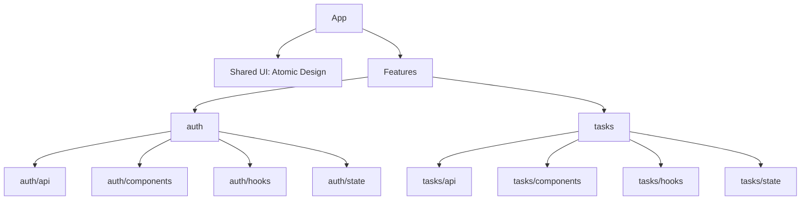

# Arquitectura Modular orientada a Features en React (Escalable + Reutilizable + Atomic Design)

Este documento propone una forma de organizar proyectos React cuando crecen en tamaño y complejidad: **arquitectura modular orientada a features** (Feature-Driven) combinada con **Atomic Design** para componentes UI.

La meta es que el proyecto sea:

- **Escalable**: agregar features sin “romper” el orden.
- **Reutilizable**: no duplicar componentes y lógica.
- **Mantenible**: el código sea fácil de entender, testear y refactorizar.
- **Amigable para equipos**: varias personas trabajando sin pisarse.

---

## 1) El problema típico cuando React crece

Cuando una app empieza pequeña, suele tener una estructura tipo:

```
src/
  components/
  pages/
  hooks/
  services/
```

Al principio funciona, pero con el tiempo aparecen síntomas:

- Componentes “gigantes” que hacen de todo.
- Imports cruzados por todo el proyecto (dependencias enredadas).
- Lógica repetida.
- Dificultad para saber “dónde vive” una cosa.
- Cambios pequeños que rompen cosas no relacionadas.

**Solución**: dividir por **módulos funcionales** (features) + una base de componentes UI reutilizables (Atomic Design).

---

## 2) Idea central: “Feature-Driven Modular Architecture”

**Modular** significa: separar la app en **módulos autocontenidos**.

**Feature-driven** significa: cada módulo representa una **funcionalidad del negocio**, por ejemplo:

- `auth` (login/registro/permisos)
- `tasks` (lista, filtros, CRUD de tareas)
- `profile` (perfil de usuario)
- `notifications` (notificaciones)

Cada feature debería contener (según necesidad):

- **UI específica** de ese feature (componentes propios)
- **hooks** propios (lógica reutilizable del feature)
- **api** (llamadas al backend relacionadas con el feature)
- **estado** (Redux slice / Zustand store / React Query keys, etc.)
- **types** del feature

---

## 3) Atomic Design (para componentes compartidos)

Atomic Design organiza UI por “niveles”:

- **Atoms**: piezas pequeñas (Button, Input, Text, Icon)
- **Molecules**: combinación simple de atoms (FormField, SearchBar)
- **Organisms**: bloques más complejos (Header, Modal, Card compleja)
- **Templates**: estructura/layout de páginas (DashboardLayout, AuthLayout)
- (**Pages** suele vivir en `pages/` o dentro de cada feature, según el enfoque)

La ventaja: consistencia visual y reutilización real.

---

## 4) Estructura de carpetas recomendada (ejemplo)

> Ejemplo para una app con dos features: `auth` y `tasks`.

```
src/
  api/
    client.ts
    endpoints.ts

  assets/
    images/
    fonts/

  components/
    atoms/
      Button/
        Button.tsx
        Button.types.ts
        Button.module.css
        index.ts
    molecules/
      FormField/
        FormField.tsx
        index.ts
    organisms/
      AppHeader/
        AppHeader.tsx
        index.ts
    templates/
      DashboardLayout/
        DashboardLayout.tsx
        index.ts

  features/
    auth/
      api/
        auth.api.ts
      components/
        LoginForm.tsx
      hooks/
        useLogin.ts
      state/
        authSlice.ts
      types/
        auth.types.ts
      index.ts

    tasks/
      api/
        tasks.api.ts
      components/
        TaskForm.tsx
        TaskList.tsx
        TaskFilter.tsx
      hooks/
        useTasks.ts
      state/
        tasksSlice.ts
      types/
        tasks.types.ts
      index.ts

  hooks/
    useLocalStorage.ts

  layouts/
    AppShell.tsx

  services/
    logger.ts

  store/
    store.ts

  styles/
    theme.ts
    globals.css

  types/
    common.ts

  utils/
    formatDate.ts

  App.tsx
  main.tsx
```

### ¿Qué va en cada carpeta?

- `components/`: UI **reutilizable global** (Atomic Design)
- `features/`: todo lo que sea **propio de una funcionalidad**
- `api/`: configuración común (cliente, interceptores, baseURL, etc.)
- `store/`: store global (si usas Redux). Los slices pueden vivir en cada feature.
- `utils/`, `types/`, `hooks/`: recursos globales reutilizables
- `layouts/` y `components/templates/`: estructura general de pantalla

---

## 5) Diagrama (imagen) de la idea



> Si tu visor de Markdown no renderiza `mermaid`, puedes pegarlo en GitHub o en un editor compatible.

---

## 6) Ejemplos de código (didácticos)

### 6.1) API Client centralizado

```ts name=src/api/client.ts
export type HttpMethod = "GET" | "POST" | "PUT" | "PATCH" | "DELETE";

type RequestOptions = {
  method?: HttpMethod;
  body?: unknown;
  headers?: Record<string, string>;
};

const BASE_URL = import.meta.env.VITE_API_BASE_URL ?? "https://api.example.com";

export async function http<T>(path: string, options: RequestOptions = {}): Promise<T> {
  const res = await fetch(`${BASE_URL}${path}`, {
    method: options.method ?? "GET",
    headers: {
      "Content-Type": "application/json",
      ...(options.headers ?? {}),
    },
    body: options.body ? JSON.stringify(options.body) : undefined,
  });

  if (!res.ok) {
    // Aquí podrías mapear errores por código, etc.
    throw new Error(`HTTP ${res.status} - ${await res.text()}`);
  }

  return res.json() as Promise<T>;
}
```

---

### 6.2) Feature: Auth (API + Hook + UI)

#### Types

```ts name=src/features/auth/types/auth.types.ts
export type LoginRequest = {
  email: string;
  password: string;
};

export type LoginResponse = {
  token: string;
  user: { id: string; name: string; email: string };
};
```

#### API del feature

```ts name=src/features/auth/api/auth.api.ts
import { http } from "@/api/client";
import type { LoginRequest, LoginResponse } from "../types/auth.types";

export function loginApi(payload: LoginRequest) {
  return http<LoginResponse>("/auth/login", { method: "POST", body: payload });
}
```

#### Hook del feature (lógica reutilizable)

```ts name=src/features/auth/hooks/useLogin.ts
import { useState } from "react";
import { loginApi } from "../api/auth.api";
import type { LoginRequest } from "../types/auth.types";

export function useLogin() {
  const [loading, setLoading] = useState(false);
  const [error, setError] = useState<string | null>(null);

  async function login(payload: LoginRequest) {
    setLoading(true);
    setError(null);
    try {
      const data = await loginApi(payload);
      // Aquí guardarías token (context, redux, localStorage, etc.)
      return data;
    } catch (e) {
      setError(e instanceof Error ? e.message : "Error desconocido");
      throw e;
    } finally {
      setLoading(false);
    }
  }

  return { login, loading, error };
}
```

#### UI del feature (usa componentes shared)

```tsx name=src/features/auth/components/LoginForm.tsx
import { useState } from "react";
import { useLogin } from "../hooks/useLogin";

export function LoginForm() {
  const { login, loading, error } = useLogin();
  const [email, setEmail] = useState("");
  const [password, setPassword] = useState("");

  async function onSubmit(e: React.FormEvent) {
    e.preventDefault();
    await login({ email, password });
    alert("Login OK");
  }

  return (
    <form onSubmit={onSubmit} style={{ display: "grid", gap: 12, maxWidth: 360 }}>
      <h2>Iniciar sesión</h2>

      <label>
        Email
        <input value={email} onChange={(e) => setEmail(e.target.value)} />
      </label>

      <label>
        Contraseña
        <input type="password" value={password} onChange={(e) => setPassword(e.target.value)} />
      </label>

      <button type="submit" disabled={loading}>
        {loading ? "Entrando..." : "Entrar"}
      </button>

      {error && <p style={{ color: "crimson" }}>{error}</p>}
    </form>
  );
}
```

---

### 6.3) Shared UI: Atom Button (ejemplo mínimo)

```tsx name=src/components/atoms/Button/Button.tsx
import type { ButtonHTMLAttributes } from "react";

type Props = ButtonHTMLAttributes<HTMLButtonElement> & {
  variant?: "primary" | "secondary";
};

export function Button({ variant = "primary", style, ...rest }: Props) {
  const base = {
    padding: "10px 14px",
    borderRadius: 10,
    border: "1px solid #ddd",
    cursor: "pointer",
  } as const;

  const variants = {
    primary: { background: "#111827", color: "white" },
    secondary: { background: "white", color: "#111827" },
  } as const;

  return <button style={{ ...base, ...variants[variant], ...style }} {...rest} />;
}
```

---

## 7) Reglas prácticas (para que no se rompa el orden)

1. **Lo que es de un feature, vive en su feature**  
   Evita que `tasks` importe cosas internas de `auth` (o viceversa).
2. **Shared UI no debe depender de features**  
   `components/atoms/*` no debería importar desde `features/*`.
3. **API y lógica de negocio van separadas de la UI**  
   UI consume hooks/servicios, no al revés.
4. **Si algo se repite en 2+ features, evalúa moverlo a shared**  
   Pero no te adelantes: comparte cuando duela de verdad.

---

## 8) Caso de uso: ¿cuándo conviene esta arquitectura?

Funciona especialmente bien en:

- CRMs (contactos, reportes, ventas, etc.)
- E-commerce (catálogo, carrito, checkout, perfil)
- SaaS con módulos (billing, analytics, permisos)
- Social apps (feed, chat, perfiles, notificaciones)

---

## 9) Checklist para implementar en un proyecto real

- [ ] Definir lista de features principales
- [ ] Crear `components/` con Atomic Design para UI reutilizable
- [ ] Mover API a un `api/client.ts` común
- [ ] Para cada feature: `api/`, `components/`, `hooks/`, `state/`, `types/`
- [ ] Asegurar convenciones de import (alias `@/` recomendado)
- [ ] Documentar reglas de dependencias (shared -> feature, nunca al revés)

---

## 10) Próximos pasos (si quieres subir el nivel)

- Añadir **tests** por feature (unit + integration)
- Implementar **lazy loading** por feature (code-splitting)
- Integrar **React Query** o **Redux Toolkit** por slices de feature
- Reglas ESLint para evitar imports prohibidos entre features

---

### Referencia conceptual
Este README se basa en el enfoque de arquitectura modular orientada a features y la organización de UI con Atomic Design, popular en proyectos React que priorizan escalabilidad y mantenibilidad.
